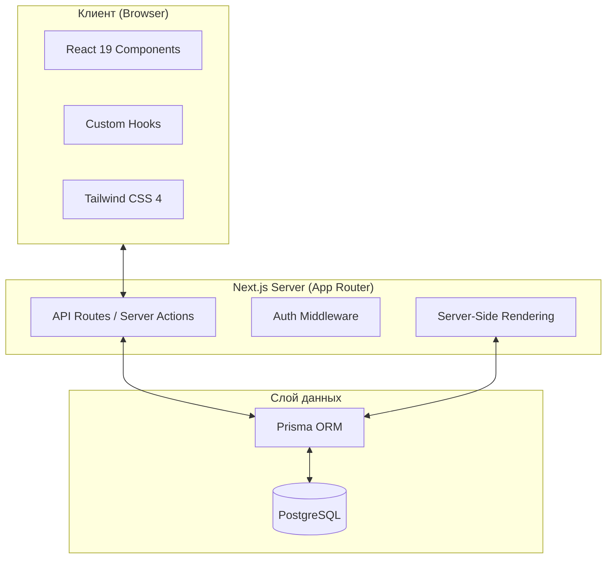

<div align="center">

# Web Cinema

**Современный онлайн-кинотеатр с высокой производительностью и удобным интерфейсом**

[](https://nextjs.org/)
[](https://react.dev/)
[](https://tailwindcss.com/)
[](https://www.prisma.io/)
[](https://www.postgresql.org/)

</div>

---

## Содержание

- [О проекте](#о-проекте)
- [Технологический стек](#технологический-стек)
- [Архитектура](#архитектура)
- [Структура проекта](#структура-проекта)
- [Быстрый старт](#быстрый-старт)
- [Команды](#команды)
- [Документация](#документация)

---

## О проекте

### Проблема

Многие современные платформы для просмотра видео перегружены лишними элементами, имеют медленный интерфейс и сложную навигацию, что мешает пользователю просто наслаждаться контентом.

### Решение

**Web Cinema** — это легкий и быстрый онлайн-кинотеатр. Мы сфокусировались на UX: плавные анимации, мгновенный поиск, удобный плеер и адаптивность под любые устройства. Использование Next.js 16 и React 19 обеспечивает максимальную производительность.

---

## Архитектура



---

## Быстрый старт

### Требования

<div align="center">

| Компонент | Минимум | Рекомендуется |
| :-------: | :-----: | :-----------: |
|  Node.js  | 20.x    |      22+      |
|  pnpm     | 9.x     |      9+       |
| PostgreSQL| 15+     |      16+      |

</div>

### Установка

1. Клонируйте репозиторий:
```bash
git clone https://github.com/your-username/web.cinema.git
cd web.cinema
```

2. Установите зависимости:
```bash
cd app/frontend
pnpm install
```

3. Настройте базу данных:
```bash
# Скопируйте .env и укажите DATABASE_URL
cp .env.example .env
pnpm prisma db push
```

4. Запустите проект:
```bash
pnpm dev
```

---

## Команды

```bash
# Запуск в режиме разработки
pnpm dev

# Сборка проекта
pnpm build

# Запуск production-версии
pnpm start

# Проверка линтером
pnpm lint

# Генерация клиента Prisma
pnpm prisma generate

# Открытие Prisma Studio (интерфейс БД)
pnpm prisma studio
```
