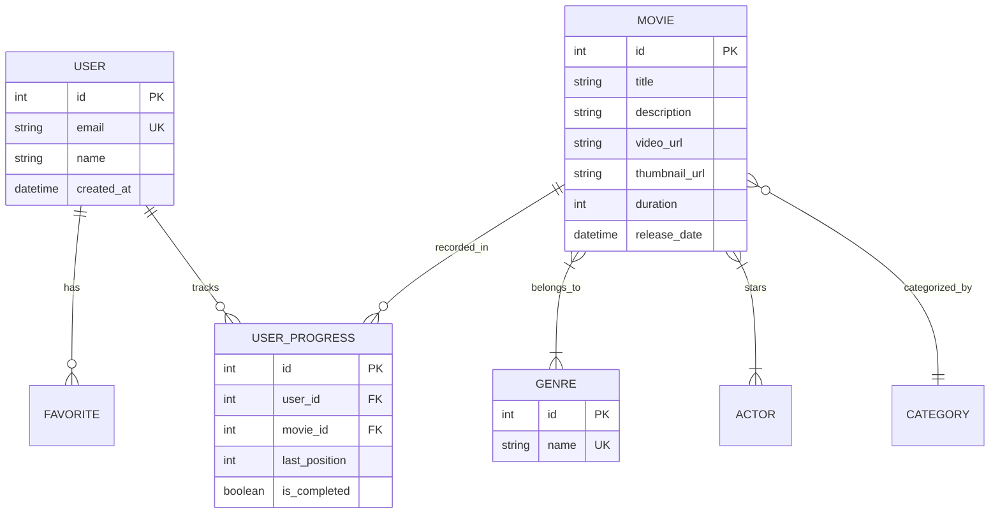

<div align="center">

# Web Cinema Database

**Документация по модели данных и управлению базой данных**

[](https://www.postgresql.org/)
[](https://www.prisma.io/)

</div>

---

## Содержание

- [Назначение](#назначение)
- [Ключевые сущности](#ключевые-сущности)
- [Модель данных (ERD)](#модель-данных-erd)
- [Миграции](#миграции)
- [Управление данными](#управление-данными)

---

## Назначение

Этот документ описывает структуру базы данных проекта Web Cinema. В качестве основного хранилища используется **PostgreSQL**, а взаимодействие с данными осуществляется через **Prisma ORM**.

---

## Ключевые сущности

<div align="center">

| **Сущность**       | **Таблица**         | **Назначение**                                   |
| :----------------- | :------------------ | :----------------------------------------------- |
| Пользователи       | `User`              | Учетные записи пользователей и профили           |
| Фильмы             | `Movie`             | Основная информация о фильмах и сериалах         |
| Жанры              | `Genre`             | Справочник жанров                                |
| Категории          | `Category`          | Группировка контента (фильмы, сериалы, новинки)  |
| Актеры             | `Actor`             | Актерский состав и информация о персонах         |
| Прогресс           | `UserProgress`      | Сохраненный прогресс просмотра для пользователей |
| Избранное          | `Favorite`          | Список "Хочу посмотреть"                         |

</div>

---

## Модель данных (ERD)



---

## Миграции

Для управления схемой БД используется Prisma Migrate.

<div align="center">

| **Параметр**       | **Значение**                                                     |
| :----------------- | :--------------------------------------------------------------- |
| Инструмент         | Prisma Migrate                                                   |
| Конфигурация       | `app/frontend/prisma/schema.prisma`                              |
| Папка миграций     | `app/frontend/prisma/migrations/`                                |
| Формат имени       | `YYYYMMDDHHMMSS_description`                                     |

</div>

### Команды Prisma

```bash
# Генерация клиента Prisma
pnpm prisma generate

# Создание и применение миграции (development)
pnpm prisma migrate dev --name init_schema

# Применение миграций (production)
pnpm prisma migrate deploy

# Сброс базы данных
pnpm prisma migrate reset

# Открытие визуального редактора БД
pnpm prisma studio
```

---

## Управление данными

### Seed данных

Для наполнения базы данных начальными данными (фильмами, жанрами) используйте команду:
```bash
pnpm prisma db seed
```
Скрипт сидирования находится в `app/frontend/prisma/seed.ts`.

### Безопасность
- Все чувствительные данные (DATABASE_URL) должны храниться в файле `.env`.
- Не коммитьте файл `.env` в репозиторий.
