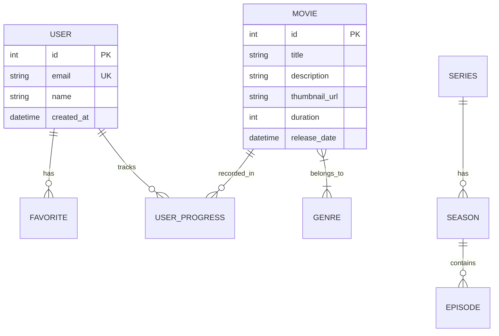

<div align="center">

# Web Cinema Database

**Документация по модели данных и управлению базой данных**

[](https://www.postgresql.org/)
[](https://www.prisma.io/)

</div>

---

## Содержание

- [Назначение](#назначение)
- [Ключевые сущности](#ключевые-сущности)
- [Модель данных (ERD)](#модель-данных-erd)
- [Миграции и команды](#миграции-и-команды)
- [Seed и управление данными](#seed-и-управление-данными)

---

## Назначение

Документ описывает структуру базы данных проекта Web Cinema и процесс управления схемой через Prisma. В проекте основным источником схемы является `app/frontend/prisma/schema.prisma`.

---

## Ключевые сущности

В проекте используются основные сущности медиаплатформы — фильмы, сериалы, сезоны, эпизоды, жанры и пользователи. Примерный список сущностей:

| Сущность | Описание |
| :------- | :------- |
| `User` | Учетные записи и профиль пользователя |
| `Movie` | Фильм/медиаконтент (метаданные, длительность, ссылки) |
| `Series` | Сериал с сезоном/эпизодами |
| `Season` | Сезон сериала |
| `Episode` | Эпизод сезона |
| `Genre` | Жанры/теги |
| `Favorite` | Избранное пользователя |
| `UserProgress` | Прогресс просмотра |

Для точной схемы смотрите `app/frontend/prisma/schema.prisma` и сгенерированный клиент `app/frontend/prisma/generated/prisma/client.ts`.

---

## Модель данных (ERD)

Ниже — упрощённая ER-диаграмма, отражающая основные связи:



---

## Миграции и команды

В проекте используется Prisma Migrate. Файлы схемы и миграции находятся в `app/frontend/prisma/`.

Рекомендуемые команды (в корне репозитория запускайте их для frontend пакета через `pnpm`):

```bash
# Генерация клиента Prisma
pnpm --filter frontend prisma generate

# Создание и применение миграции (development)
pnpm --filter frontend prisma migrate dev --name init_schema

# Применение миграций (production)
pnpm --filter frontend prisma migrate deploy

# Сброс базы данных (dev only)
pnpm --filter frontend prisma migrate reset

# Открытие Prisma Studio
pnpm --filter frontend prisma studio
```

---

## Seed и управление данными

Для заполнения тестовых данных используйте seed-скрипт:

```bash
pnpm --filter frontend prisma db seed
```

Скрипт сидирования расположен в `app/frontend/prisma/seed.ts`.

### Безопасность

- Секреты (например `DATABASE_URL`) должны храниться в `.env` и не включаться в репозиторий.
- Для production используйте защищённое хранилище секретов (Vault, Secrets Manager) и CI/CD переменные.

---

Если хотите, могу пройтись по `app/frontend/prisma/schema.prisma` и вставить сюда точный список таблиц/полей и примеры SQL-запросов.
